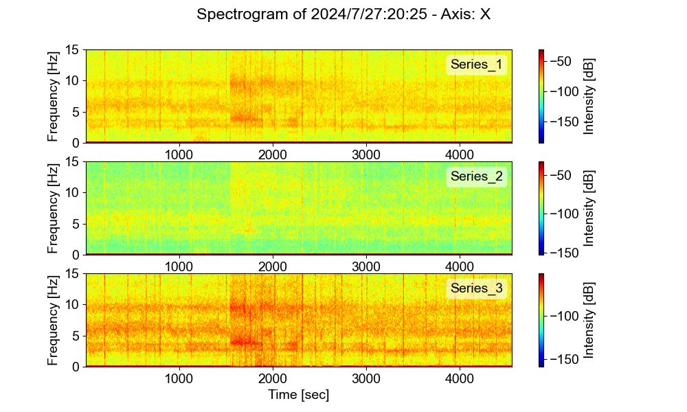

## Request data from data base 

```python
from config import database_uri_local, connection_string, table_name
from orm_model import get_measurements_between_dates, Base, create_engine, sessionmaker , measurements_to_numpy ,create_measurement_class,get_latest_measurements

session = create_session(connection_string)
start_date = datetime(2024, 7, 27, 20, 25, 0, 0)
end_date = datetime(2024, 7, 27, 22, 25, 0, 0)
Measurement = create_measurement_class(table_name)
measurements = get_measurements_between_dates(start_date, end_date, session, Measurement)

data_array  = measurements_to_numpy(measurements) #Ndarray
```

## Process data: Plot spectrogram

```python
from Modal_Engine._engine import (SingleMeasurement,
                                  FFTDomain,
                                  DataVisualizer)


def plt_spectrogram(measurement: SingleMeasurement):
    fdomain = FFTDomain(measurement,NFFT=2**6)
    fdomain.fft()
    data_vis1 = DataVisualizer(fdomain)
    data_vis1.plot_spectrogram(cmap='jet')

file_name = "data/measurements_2024_7_27:20:25_2h.pkl"
data_set_time = "2024/7/27:20:25"
data_array = load_pickle(file_name)
filter = [0, 2, 4]
measurement_1 = SingleMeasurement(name =  f"{data_set_time} - Axis: X", fs = 100,file_path= None,
                                    description="2h test")
measurement_1 = measurement_1.set_data(data_array[:,filter]).resample(30)
plt_spectrogram(measurement_1)
```

# Result


